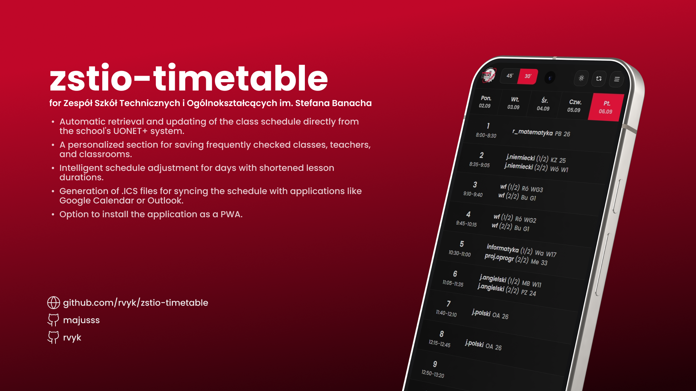

[Polska wersja](README.pl.md) / English version

# ✨ ZSTiO Timetable 🚀

A modern and refreshed timetable application for Zespół Szkół Technicznych i Ogólnokształcących (ZSTiO), built with cutting-edge web technologies. This intuitive application simplifies access to class schedules, providing a seamless experience for students, teachers, and staff.

## 🚀 Key Features

- **Universal Compatibility 🌍:** Adaptable to any school using UONET timetables. Simply configure the `NEXT_PUBLIC_TIMETABLE_URL` environment variable.
- **Multiple Data Sources Support 🔄:** Configure multiple timetable sources and switch between them seamlessly.
- **Personalized Favorites ⭐:** Save your frequently accessed classes, teachers, and rooms for instant access.
- **Effortless Free Room Search 🔎:** Quickly find available rooms by day and lesson number.
- **Smart Shortened Lesson Calculator ⏱️:** Dynamically adjusts the timetable to reflect shortened lesson durations.
- **Convenient Calendar Export (ICS) 📅:** Download your timetable in ICS format for seamless integration with your favorite calendar applications.
- **Responsive Design for All Devices 📱💻:** Access your timetable on the go or from your desktop with a consistent and user-friendly interface.
- **Elegant Dark Mode 🌙:** Switch between light and dark themes for optimal viewing comfort.
- **Offline Access with PWA Support 🔌:** Install the application as a Progressive Web App for blazing-fast loading and offline access.
- **Robust Error Tracking (Sentry) ⚠️:** Integrated with Sentry for proactive error monitoring and enhanced application stability.
- **Streamlined Deployment with Docker 🐳:** Leverage the provided Dockerfile for effortless deployment and a consistent environment.

## 💻 Tech Stack

- **Next.js:** The React framework for production.
- **TypeScript:** For type safety and improved developer experience.
- **Tailwind CSS:** Rapidly build modern user interfaces.
- **shadcn/ui:** Beautiful and accessible UI components.
- **@majusss/timetable-parser-js:** Efficient data scraping and parsing.
- **Zustand:** Lightweight and performant state management.
- **Next Themes:** Effortless theme switching.
- **Sentry:** Real-time error tracking and performance monitoring.
- **Docker:** Containerization for simplified deployment.

## Installation and Setup

1. **Clone the repository:**

   ```bash
   git clone https://github.com/rvyk/zstio-timetable.git
   cd zstio-timetable
   ```

2. **Install dependencies:**

   ```bash
   pnpm install
   ```

3. **Configure environment variables:**

   Create a `.env.local` file based on `.env.example` and set the following:
   - **`NEXT_PUBLIC_TIMETABLE_URL` (required):** The URL of your school's UONET timetable.
   - **`NEXT_PUBLIC_TIMETABLES_URL` (optional):** Configure multiple timetable sources separated by spaces.
   - **`NEXT_PUBLIC_APP_URL` (required):** The base URL of your application.
   - **`SENTRY_AUTH_TOKEN` (optional):** Your Sentry authentication token.

4. **Development Server:**

   ```bash
   pnpm dev
   ```

   Access the application at `http://localhost:3000`.

5. **Production Build (Docker Recommended):**

   ```bash
   docker build -t zstio-timetable-docker .
   docker run -p 3000:3000 zstio-timetable-docker
   ```

6. **Production Build (Alternative):**

   ```bash
   pnpm build
   pnpm start
   ```

## Contributing

Contributions are welcome! Please open an issue or submit a pull request.

## License

MIT License. See the [LICENSE](LICENSE) file for details.

## 🌐 Useful Links

[](https://github.com/rvyk/) 

[](https://github.com/majusss/) 

[](https://dev.rvyk.tech/)
[](https://plan.zstiojar.edu.pl/)
