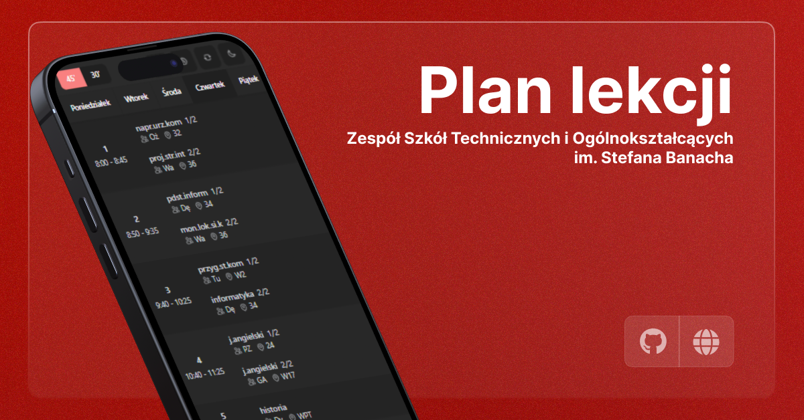

# ZSTiO Timetable

A modern, refreshed version of the [school timetable](https://www.zstio-elektronika.pl/plan/index.html) for [Zespół Szkół Technicznych i Ogólnokształcących](https://zstiojar.edu.pl/), built with the latest web technologies. This project simplifies access to class schedules by automatically scraping and parsing data using [@majusss/timetable-parser-js](https://github.com/majusss/timetable-parser-js). Special thanks to [Marioneq4958](https://github.com/marioneq4958) for the layout inspiration.

## 🎯 Key Features

- **Universal Timetable:** Easily adaptable to any school that uses UONET-generated schedules. Just update the `NEXT_PUBLIC_TIMETABLE_URL` in the `.env.local` file with the URL of your school's timetable.
- **Custom Substitutions:** Allows you to manually adjust substitution data for your specific requirements.
- **Responsive Design:** Optimized for both desktop and mobile, ensuring the timetable is accessible on any device.

## 🚀 Tech Stack

- **[Next.js](https://nextjs.org/):** A powerful React framework for building server-side rendered applications.
- **[TypeScript](https://www.typescriptlang.org/):** A superset of JavaScript that enables static typing and error checking during development.
- **[Tailwind CSS](https://tailwindcss.com/):** A utility-first CSS framework that allows rapid UI development with a focus on customization.
- **[shadcn/ui](https://ui.shadcn.com/):** A feature-rich UI library providing ready-to-use React components to streamline frontend development.

## ⚙️ Setup Guide

1. **Clone the repository:**

   ```bash
   git clone https://github.com/rvyk/zstio-timetable.git
   cd zstio-timetable
   ```

2. **Install dependencies:**

   ```bash
   pnpm install
   ```

3. **Configure environment variables:**

   - Create a `.env.local` file in the project root.
   - Set the `NEXT_PUBLIC_TIMETABLE_URL` to the URL of your school's timetable.
   - Set the `NEXT_PUBLIC_APP_URL` to the base URL where your application will be hosted (e.g., your local development environment or production domain).

   ```bash
   NEXT_PUBLIC_TIMETABLE_URL="http://www.zstio-elektronika.pl/plan/"
   NEXT_PUBLIC_APP_URL="http://localhost:3000/"
   ```

   > The `NEXT_PUBLIC_APP_URL` variable is important for defining the base URL of your application, which can be used for links, API calls, and other server-side features in both development and production.

4. **Run the development server:**

   ```bash
   pnpm dev
   ```

   Visit [http://localhost:3000](http://localhost:3000) to view the app.

5. **Build for production (recommended with Docker):**

   To ensure the application runs smoothly in production, it is recommended to use Docker for building and deploying. This helps maintain consistency between environments and simplifies the deployment process.

   **Steps to build and run with Docker:**

   1. **Build the Docker image:**

      ```bash
      docker build -t zstio-timetable-docker .
      ```

   2. **Run the Docker container:**
      ```bash
      docker run -p 3000:3000 zstio-timetable-docker
      ```

   This will build the application and run it inside a Docker container, making it easy to deploy across different platforms or environments.

6. **Build for production (alternative method):**
   ```bash
   pnpm build
   ```

## 🙌 Credits

- **[@majusss/timetable-parser](https://github.com/majusss/timetable-parser-js):** For data scraping and parsing functionality.
- **[Marioneq4958](https://github.com/marioneq4958):** For layout inspiration.

## 📄 License

This project is licensed under the MIT License. Feel free to use and modify it as per your needs.

## 🌐 Useful Links

[](https://github.com/rvyk/) 

[](https://github.com/majusss/) 

[](https://dev.rvyk.tech/)
[](https://plan.zstiojar.edu.pl/)
