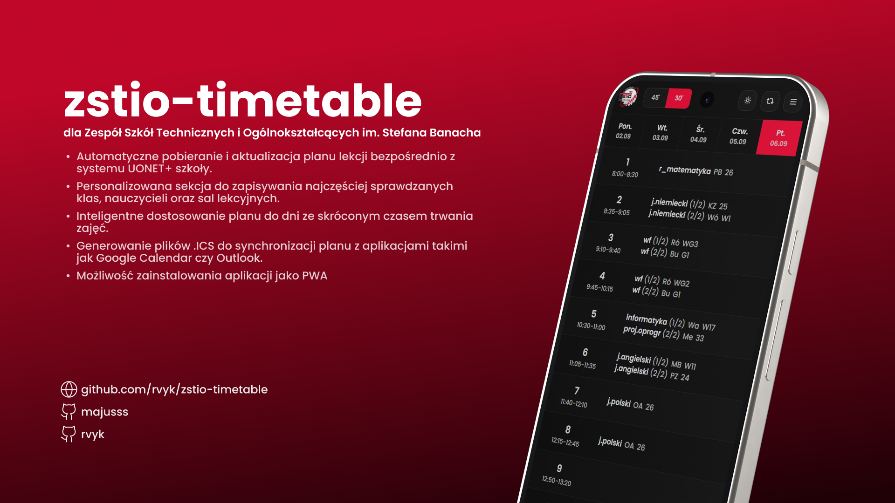

Polska wersja / [English version](README.md)

# ✨ ZSTiO Timetable 🚀

Nowoczesna i odświeżona aplikacja planu lekcji dla Zespołu Szkół Technicznych i Ogólnokształcących (ZSTiO), stworzona z wykorzystaniem najnowszych technologii webowych. Ta intuicyjna aplikacja ułatwia dostęp do planów zajęć i zastępstw, oferując bezproblemową obsługę dla uczniów, nauczycieli i pracowników.

## 🚀 Najważniejsze Funkcje

- **Uniwersalna Kompatybilność 🌍:** Przystosowana do każdej szkoły korzystającej z planów UONET. Wystarczy skonfigurować zmienną środowiskową `NEXT_PUBLIC_TIMETABLE_URL`.
- **Łatwa Integracja Zastępstw 🔄:** Przeglądaj zastępstwa bezpośrednio w planie lekcji, z możliwością ręcznych modyfikacji (wymaga `NEXT_PUBLIC_SUBSTITUTIONS_URL`).
- **Porównywanie Planów 📊:** Porównuj aktualny plan lekcji z nowymi wersjami (/nowy-plan, do konfiguracji w `/src/constants/settings.ts (NEW_TIMETABLE_PREFIX)`), aby śledzić zmiany, gdy dostępne są aktualizacje (wymaga `REDIS_URL`).
- **Ulubione ⭐:** Zapisz najczęściej przeglądane klasy, nauczycieli i sale, aby mieć do nich szybki dostęp.
- **Wygodne Wyszukiwanie Wolnych Sal 🔎:** Szybko sprawdź dostępne sale według dnia i numeru lekcji.
- **Inteligentne Skrócone Lekcje ⏱️:** Automatyczna adaptacja planu do skróconych godzin lekcyjnych.
- **Eksport do Kalendarza (ICS) 📅:** Pobierz swój plan lekcji w formacie ICS, aby łatwo zsynchronizować go z ulubioną aplikacją kalendarza.
- **Responsywny Interfejs na Wszystkich Urządzeniach 📱💻:** Przeglądaj plan lekcji z dowolnego urządzenia dzięki spójnemu i intuicyjnemu interfejsowi.
- **Elegancki Tryb Ciemny 🌙:** Przełączaj się między jasnym i ciemnym motywem dla komfortu użytkowania.
- **Dostęp Offline dzięki PWA 🔌:** Zainstaluj aplikację jako PWA (Progressive Web App) dla szybszego ładowania i pracy offline.
- **Zaawansowane Śledzenie Błędów (Sentry) ⚠️:** Integracja z Sentry umożliwia monitorowanie błędów i stabilność działania.
- **Łatwe Wdrażanie z Dockerem 🐳:** Dzięki dołączonemu plikowi Dockerfile wdrażanie jest szybkie i gwarantuje spójność środowiska.

## 💻 Wykorzystane technologie

- **Next.js:** Framework Reacta do aplikacji produkcyjnych.
- **TypeScript:** Zapewnia typowanie i lepsze doświadczenia dla programistów.
- **Tailwind CSS:** Szybkie tworzenie nowoczesnych interfejsów użytkownika.
- **shadcn/ui:** Piękne i dostępne komponenty interfejsu.
- **@majusss/timetable-parser-js:** Wydajne przetwarzanie danych i parsing.
- **@majusss/substitutions-parser:** Łatwe zarządzanie danymi zastępstw.
- **Zustand:** Lekki i wydajny system zarządzania stanem.
- **Next Themes:** Proste przełączanie motywów.
- **Sentry:** Śledzenie błędów i monitorowanie wydajności w czasie rzeczywistym.
- **Docker:** Konteneryzacja ułatwiająca wdrożenie.

## Instalacja i Konfiguracja

1. **Sklonuj repozytorium:**

   ```bash
   git clone https://github.com/rvyk/zstio-timetable.git
   cd zstio-timetable
   ```

2. **Zainstaluj zależności:**

   ```bash
   pnpm install
   ```

3. **Skonfiguruj zmienne środowiskowe:**

   Utwórz plik `.env.local` na podstawie `.env.example` i ustaw:

   - **`NEXT_PUBLIC_TIMETABLE_URL` (wymagane):** URL do planu lekcji Twojej szkoły (UONET).
   - **`NEXT_PUBLIC_APP_URL` (wymagane):** Podstawowy URL aplikacji.
   - **`NEXT_PUBLIC_SUBSTITUTIONS_URL` (opcjonalne):** URL strony z zastępstwami. Pozostaw puste, jeśli nie jest używane.
   - **`REDIS_URL` (opcjonalne):** String połączenia z bazą danych Redis do porównywania planów lekcji.
   - **`SENTRY_AUTH_TOKEN` (opcjonalne):** Token autoryzacji Sentry do śledzenia błędów.
   - **`DOCKERIZED` (opcjonalne):** Ustaw na "true" podczas uruchamiania w Dockerze, aby włączyć tryb standalone.
   - **`SENTRY_SUPPRESS_TURBOPACK_WARNING` (opcjonalne):** Ustaw na 1, aby wyciszyć ostrzeżenia Sentry związane z Turbopack w trybie deweloperskim.

4. **Serwer Deweloperski:**

   ```bash
   pnpm dev
   ```

   Otwórz aplikację w przeglądarce pod adresem `http://localhost:3000`.

5. **Budowa Produkcyjna (Zalecany Docker):**

   ```bash
   docker build -t zstio-timetable-docker .
   docker run -p 3000:3000 zstio-timetable-docker
   ```

6. **Budowa Produkcyjna (Alternatywa):**

   ```bash
   pnpm build
   pnpm start
   ```

## Współtworzenie

Wszelkie wkłady są mile widziane! Otwórz zgłoszenie lub prześlij pull request.

## Licencja

Licencja MIT. Zobacz plik [LICENSE](LICENSE) po szczegóły.

## 🌐 Przydatne Linki

[](https://github.com/rvyk/) 

[](https://github.com/majusss/) 

[](https://dev.rvyk.tech/)
[](https://plan.zstiojar.edu.pl/)
